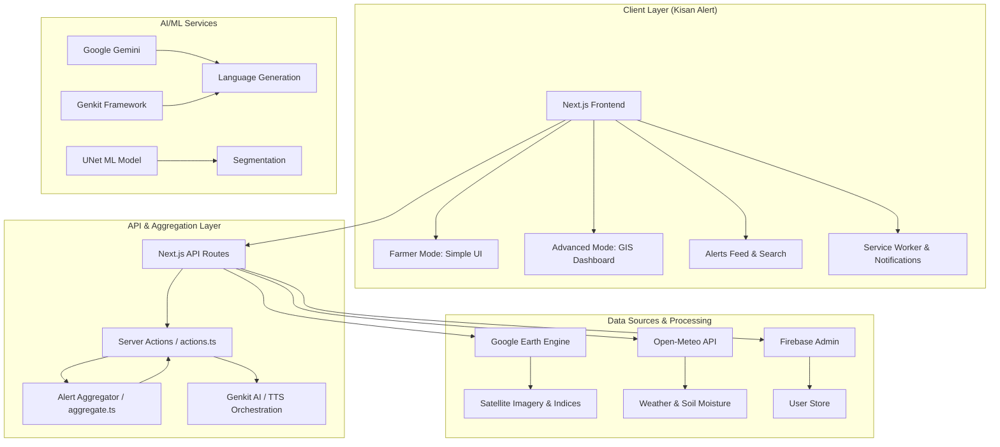
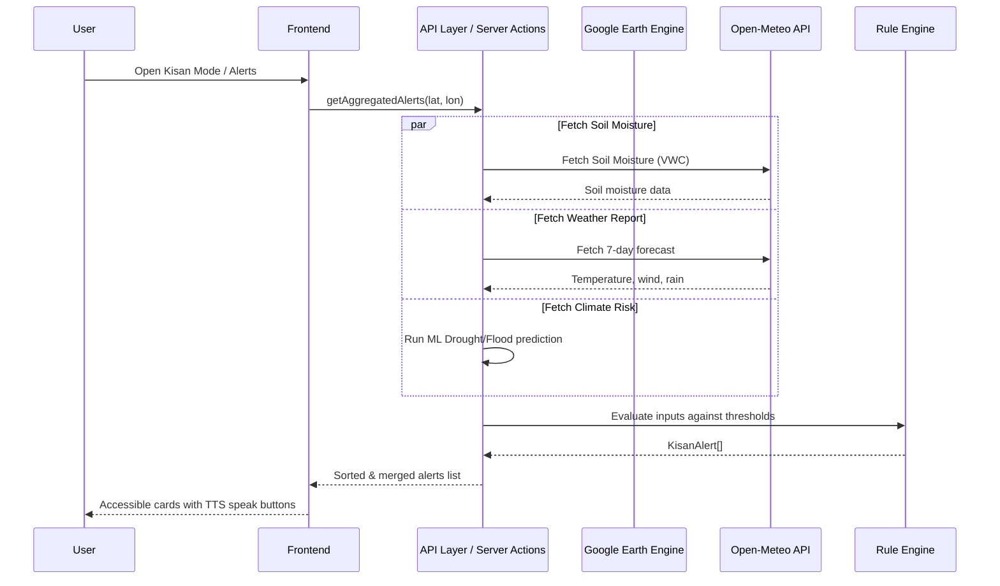
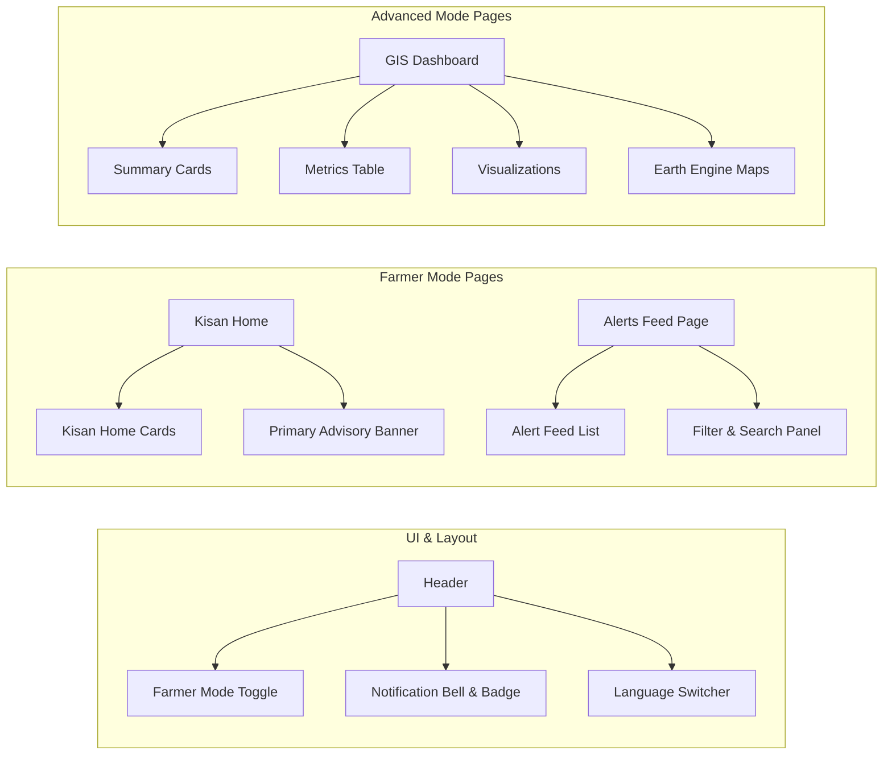

# Kisan Alert Platform

**Version:** 1.0.0 | **License:** MIT | **Status:** Production-Ready

---

A farmer-first environmental alert, irrigation scheduling, and agricultural operations advisory platform. Kisan Alert transforms complex NASA Landsat satellite imagery from Google Earth Engine (GEE), real-time meteorological forecasts, and machine learning models into simple, high-contrast, accessible alerts in 12 major Indian languages.

---

**Key Sections:**
- [Features](#features) | [Architecture](#architecture) | [Tech Stack](#tech-stack) | [Quick Start](#quick-start) | [Project Structure](#project-structure) | [Environment Variables](#environment-variables) | [Development Scripts](#development-scripts) | [Testing](#testing) | [Deployment](#deployment) | [API Reference](#api-reference)

---

## Table of Contents

- [Features](#features)
- [Architecture](#architecture)
- [Tech Stack](#tech-stack)
- [Quick Start](#quick-start)
- [Project Structure](#project-structure)
- [Environment Variables](#environment-variables)
- [Development Scripts](#development-scripts)
- [Testing](#testing)
- [Deployment](#deployment)
- [API Reference](#api-reference)
- [Performance](#performance)
- [Security](#security)
- [Contributing](#contributing)
- [License](#license)

---

## Features

### 1. Unified Alert Engine
- **Evaluation Rules:** Pure TypeScript engine (`rules.ts`) evaluates environmental inputs against agricultural thresholds (e.g. soil moisture `< 20%` or `> 60%`, expected rain `> 10mm`, extreme heat `> 40°C`, high wind speeds `> 25km/h`, and high risk probability flags) to output type-safe `KisanAlert` objects.
- **Data Aggregator (`aggregate.ts`):** Fetches data concurrently from meteorology, soil moisture, climate risk, and GEE scheduling server actions. It wraps each call in try-catch blocks to handle failures gracefully.
- **Categorized Advisories:** Groups alerts into operational areas (Water, Weather, Crop, Disease, Flood, Drought, Yield, Advisory).

### 2. Multi-Lingual Text-To-Speech (TTS)
- Integrated voice-assist capabilities that narrate alerts in the farmer's selected language.
- Supports English, Hindi, Bengali, Telugu, Marathi, Tamil, Gujarati, Kannada, Odia, Malayalam, Punjabi, and Assamese using the server-side Genkit TTS flow.

### 3. Accessible, Outdoor-Readable UI
- Designed with high-contrast, bold colors, large touch targets (minimum 44x44px), and clear, tap-friendly action panels suited for outdoor sunlight use by elderly farmers.
- Easily toggleable between **Farmer Mode** (simple, actionable advisory cards) and **Advanced Mode** (geospatial analysis and GEE charts).

### 4. PWA Notifications & Offline Support
- Service Worker integration (`public/sw.js`) supporting background fetch intercepts, notifications click focusing, and offline asset caching.
- Periodically polls for live alerts and notifies the user via browser notifications when `HIGH` or `CRITICAL` issues are identified.

### 5. Geospatial Analytics (Advanced Mode)
- **NDVI Analysis** - Normalized Difference Vegetation Index for vegetation health monitoring.
- **NDWI Analysis** - Normalized Difference Water Index for surface water detection.
- **NDBI Analysis** - Normalized Difference Built-up Index for urban expansion monitoring.
- **NBR Analysis** - Normalized Burn Ratio for fire severity assessment.

### 6. Land Cover Classification (Advanced Mode)
- Automated change detection between historical and current satellite imagery.
- Deforestation tracking and analysis.
- Urbanization monitoring.
- Water body fluctuation detection.

---

## Architecture

### System Architecture Overview



### Data Flow Architecture



### Component Architecture



---

## Tech Stack

### Core Technologies

| Category | Technology | Version | Purpose |
|----------|------------|---------|---------|
| **Framework** | Next.js | 15.5.12 | Full-stack React framework |
| **Language** | TypeScript | 5.5 | Type-safe development |
| **UI Library** | React | 18.3 | Component-based UI |
| **Styling** | Tailwind CSS | 3.4 | Utility-first CSS |
| **AI Framework** | Google Genkit | 1.21.0 | AI orchestration & TTS |
| **Geospatial** | Google Earth Engine | 0.1.411 | Satellite data processing |
| **Database** | Firebase Admin | 13.6 | Backend configuration services |

### UI Components

| Component | Library | Purpose |
|-----------|---------|---------|
| **Animations** | Radix UI | Accessible UI primitives |
| **Charts** | Recharts | Data visualization |
| **Icons** | Lucide React | Icon library |
| **Forms** | React Hook Form | Form management |
| **Validation** | Zod | Schema validation |
| **Date Handling** | date-fns | Date utilities |

---

## Quick Start

### Prerequisites

- **Node.js** >= 24.11.1 < 25
- **npm** or **yarn**
- **Google Cloud Account** (for Earth Engine and Firebase)
- **API Keys** (Gemini, Groq, Mistral - optional)

### Installation

```bash
# Clone the repository
git clone https://github.com/ArrinPaul/Kisan-Portal.git
cd Kisan-Portal

# Install dependencies
npm install

# Copy environment variables
cp .env.example .env

# Edit .env with your API keys and credentials
```

### Development Environment Setup

```bash
# Start development server
npm run dev

# In a separate terminal, start Genkit AI server
npm run genkit:dev
```

### Verify Installation

1. Open [http://localhost:9003](http://localhost:9003)
2. Toggle **Farmer Mode** in the header.
3. Access `/kisan` to verify the farmer dashboard loads.
4. Go to `/alerts` to check the alert notifications.
5. Toggle back to **Advanced Mode** to verify the GIS charts, satellite imagery, and maps load correctly.

---

## Project Structure

```
kisan-alert/
├── public/                    # Static assets
│   └── sw.js                  # PWA service worker for notifications & caching
├── src/
│   ├── ai/                    # AI services and Genkit orchestration
│   │   ├── flows/             # AI workflow definitions (TTS, crop planning)
│   │   ├── tools/             # AI tool implementations
│   │   ├── genkit.ts          # Genkit configuration
│   │   ├── providers.ts       # AI provider management
│   │   └── rate-limiter.ts    # Rate limiting logic
│   ├── app/                   # Next.js App Router Pages
│   │   ├── alerts/            # Alerts feed & search page (/alerts)
│   │   ├── kisan/             # Farmer home landing page (/kisan)
│   │   ├── crop-advisor/      # Crop recommendation feature
│   │   ├── dashboard/         # Main analytics dashboard (Advanced Mode)
│   │   ├── predict/           # Prediction interface
│   │   ├── pricing/           # Pricing plans
│   │   ├── settings/          # User settings
│   │   └── layout.tsx         # Root layout
│   ├── components/            # React components
│   │   ├── ui/                # Reusable shadcn UI components
│   │   ├── alert-badge.tsx    # Severity status badges
│   │   ├── alert-feed.tsx     # Alerts feed with voice guidance (TTS)
│   │   ├── kisan-home-cards.tsx # Large farmer navigation cards
│   │   ├── header.tsx         # Navigation header with mode toggle
│   │   ├── dashboard.tsx      # Main dashboard component
│   │   └── visualizations.tsx # Chart components
│   ├── data-pipeline/         # Data processing pipelines
│   ├── gcp-orchestration/     # GCP serverless workflows
│   ├── hooks/                 # Custom React hooks
│   │   ├── use-alerts.tsx     # Notification aggregation & polling hook
│   │   ├── use-farmer-mode.tsx # Mode switching hook
│   │   └── use-language.tsx   # Localization hook
│   ├── lib/                   # Utility functions & Core services
│   │   ├── alerts/            # Kisan Alert Engine
│   │   │   ├── aggregate.ts   # Concurrently aggregates live data
│   │   │   ├── rules.ts       # Evaluation rules and thresholds
│   │   │   └── types.ts       # Alert model TypeScript interfaces
│   │   ├── actions.ts         # Next.js Server actions
│   │   ├── firebase.ts        # Firebase configuration
│   │   ├── security.ts        # Security utilities
│   │   └── utils.ts           # Helper functions
│   ├── locales/               # 12 Regional Indian Language dictionaries
│   ├── ml/                    # Machine learning models (UNet)
│   ├── services/              # External API integrations
│   │   └── open-meteo.ts      # Weather data service
│   ├── test/                  # Test suites (Vitest)
│   └── types/                 # TypeScript definitions
├── infra/                     # Infrastructure as Code
│   └── gcp/                   # GCP configurations
├── scripts/                   # Build and deployment scripts
└── e2e/                       # Playwright End-to-End tests
```

---

## Environment Variables

### Required Variables

| Variable | Description | Example |
|----------|-------------|---------|
| `NODE_ENV` | Runtime environment | `development` |
| `GEMINI_API_KEY` | Google Gemini API key | `AIza...` |
| `GOOGLE_APPLICATION_CREDENTIALS_JSON` | GCP service account JSON | `{"type":"service_account",...}` |
| `GOOGLE_CLOUD_PROJECT` | GCP project ID | `kisan-alert-prod` |

### Optional Variables

| Variable | Description | Default |
|----------|-------------|---------|
| `GROQ_API_KEY` | Groq API key (fallback AI) | - |
| `MISTRAL_API_KEY` | Mistral API key (fallback AI) | - |
| `HUGGINGFACE_API_KEY` | HuggingFace API key | - |
| `GOOGLE_CLOUD_REGION` | GCP region | `us-central1` |
| `GCP_PIPELINE_TOPIC_PREFIX` | Pub/Sub topic prefix | `kisan-alert.pipeline` |
| `GCP_MONTHLY_BUDGET_USD` | Monthly cost limit | `1200` |
| `GCP_DAILY_RUN_QUOTA` | Daily API call limit | `6` |

---

## Development Scripts

| Command | Description |
|---------|-------------|
| `npm run dev` | Starts Next.js development server (port 9003) |
| `npm run genkit:dev` | Starts Genkit AI development server |
| `npm run lint` | Runs ESLint validations |
| `npm run lint:fix` | Automatically fixes code formatting and linting errors |
| `npm run typecheck` | Validates TypeScript compilation |
| `npm run test` | Runs all Vitest unit and integration tests |
| `npm run test:contracts` | Executes API contracts checks |
| `npm run test:e2e` | Runs E2E browser tests with Playwright |
| `npm run build` | Builds the production bundle |
| `npm run pipeline:run` | Executes the offline geospatial data pipeline |
| `npm run ml:phase2` | Trains/fine-tunes the UNet ML classification model |

---

## Testing

### Unit Testing (Vitest)
Unit tests are written to test server actions, rule evaluations, and metadata caching:
```bash
# Run unit tests
npm run test

# Run tests in watch mode
npm run test:watch
```

### Contract Testing
Tests the interface and types contract between the backend server actions and frontend pages:
```bash
# Run contract tests
npm run test:contracts
```

### E2E Testing (Playwright)
Executes cross-browser rendering checks and workflows (including mode toggle and page transitions):
```bash
# Run E2E tests
npm run test:e2e
```

---

## Deployment

### Firebase App Hosting
The frontend application layer and Next.js pages deploy directly to Firebase Hosting:
```bash
# Build production bundle
npm run build

# Deploy to Firebase
firebase deploy
```

### Google Cloud Run
ML pipelines and offline Earth Engine tasks run as serverless Docker containers on Google Cloud Run:
```bash
# Build Docker image
docker build -t kisan-alert .

# Deploy to Cloud Run
gcloud run deploy kisan-alert \
  --image kisan-alert \
  --region us-central1 \
  --allow-unauthenticated
```

---

## API Reference

### Alert Aggregation API
```typescript
// src/lib/alerts/aggregate.ts
export async function getAggregatedAlerts(
  latitude: number,
  longitude: number
): Promise<KisanAlert[]>
```

### Rule Evaluation Engine
```typescript
// src/lib/alerts/rules.ts
export function evaluateRules(
  input: RuleEvaluationInput, 
  sourceLocation?: string
): KisanAlert[]
```

### Text to Speech API
```typescript
// src/lib/actions.ts
export async function textToSpeechAction(
  text: string
): Promise<{ data: { audioDataUri: string } | null; error: string | null; }>
```

---

## Performance & Security

### Performance Optimizations
* **Server-Side Actions:** Secure database updates and Genkit processing occur on the server layer.
* **Service Worker Caching:** Assets are cached on the client to facilitate offline advisory access.
* **Polling Buffers:** Periodic queries are throttled to 30-second intervals to minimize API charges.

### Security Enhancements
* **CORS & Rate Limiting:** Rate limit guards restrict high-volume requests.
* **Payload Sanitization:** Form items are validated using Zod schemas to prevent script injection.