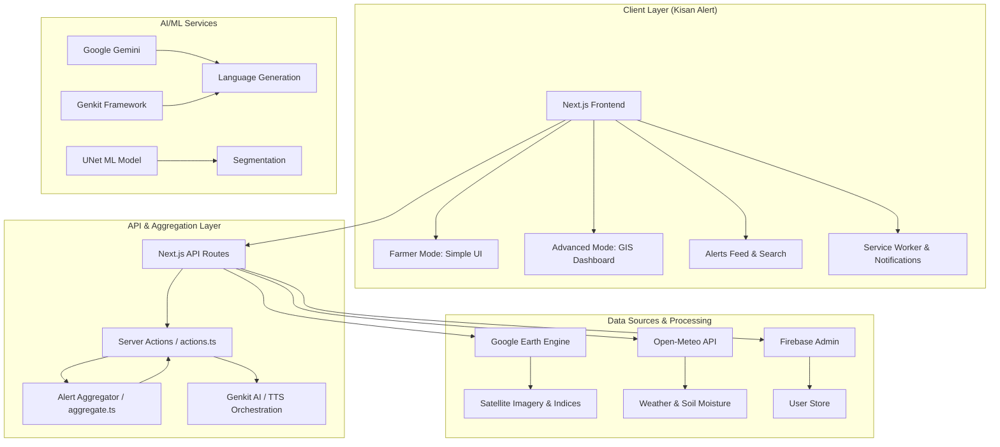
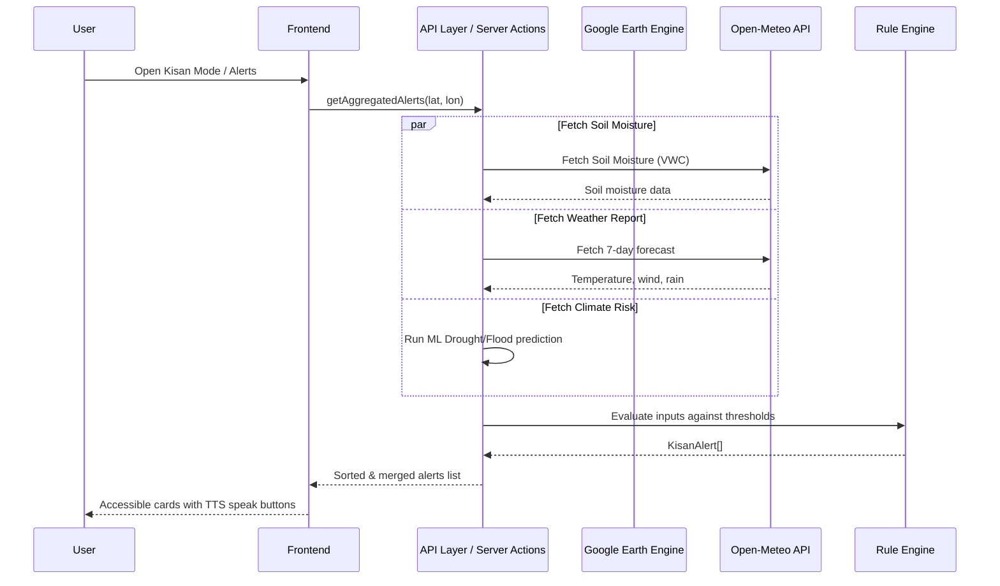
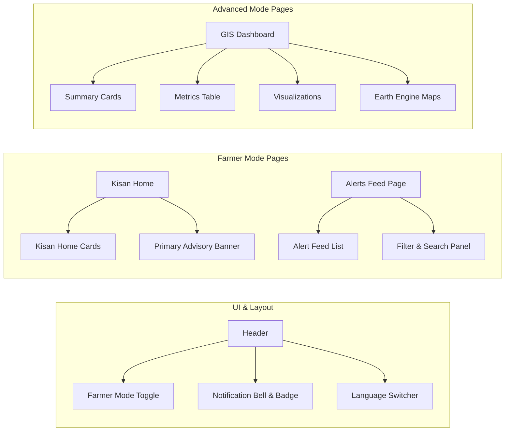

# Kisan Alert Platform

**Version:** 1.0.0 | **License:** MIT | **Status:** Production-Ready

---

A farmer-first environmental alert, irrigation scheduling, and agricultural operations advisory platform. Kisan Alert transforms complex NASA Landsat satellite imagery from Google Earth Engine (GEE), real-time meteorological forecasts, and machine learning models into simple, high-contrast, accessible alerts in 12 major Indian languages.

---

**Key Sections:**
- [Features](#features) | [Architecture](#architecture) | [Tech Stack](#tech-stack) | [Quick Start](#quick-start) | [Project Structure](#project-structure) | [Environment Variables](#environment-variables) | [Development Scripts](#development-scripts) | [Testing](#testing) | [Deployment](#deployment) | [API Reference](#api-reference)

---

## Table of Contents

- [Features](#features)
  - [Unified Alert Engine](#1-unified-alert-engine)
  - [Multi-Lingual Text-To-Speech](#2-multi-lingual-text-to-speech-tts)
  - [Dual-Mode Accessible UI](#3-dual-mode-accessible-ui)
  - [PWA Notifications and Offline Support](#4-pwa-notifications-and-offline-support)
  - [Geospatial Analytics](#5-geospatial-analytics-advanced-mode)
  - [Land Cover Classification](#6-land-cover-classification-advanced-mode)
- [Architecture](#architecture)
- [Tech Stack](#tech-stack)
- [Quick Start](#quick-start)
- [Project Structure](#project-structure)
- [Environment Variables](#environment-variables)
- [Development Scripts](#development-scripts)
- [Testing](#testing)
- [Deployment](#deployment)
- [API Reference](#api-reference)
- [Performance and Security](#performance--security)
- [Contributing](#contributing)

---

## Features

### 1. Unified Alert Engine

The alert engine is the core of Kisan Alert. It converts raw environmental sensor data into actionable, severity-rated advisories. The system is split into three distinct layers with strict separation of concerns.

#### Architecture Overview

```
  Geographic Coordinates (latitude, longitude)
                          |
                          v
+-----------------------------------------------------+
|         DATA AGGREGATION LAYER                       |
|         File: src/lib/alerts/aggregate.ts            |
|                                                     |
|   Concurrent API calls with per-source error         |
|   handling so one failure does not break others:     |
|                                                     |
|   [1] Soil Moisture API  -----> soilMoistureVwc     |
|   [2] Weather Report API -----> maxTemperatureC     |
|   [3] Drought/Flood Risk -----> droughtRisk,        |
|                                  floodRisk          |
|   [4] Irrigation Schedule -----> side-effects only  |
|   [5] Open-Meteo Precip  -----> precipitationMm     |
+-----------------------------------------------------+
                          |
                          v  (assembles RuleEvaluationInput)
+-----------------------------------------------------+
|         RULE EVALUATION LAYER                        |
|         File: src/lib/alerts/rules.ts                |
|                                                     |
|   Pure function. No API calls. No mutations.         |
|   Iterates 7 threshold checks:                      |
|                                                     |
|   soilMoistureVwc < 20%         -> HIGH   Water     |
|   soilMoistureVwc > 60%         -> MEDIUM Water     |
|   precipitationMm > 10mm        -> MEDIUM Weather   |
|   floodRisk === 'High'          -> CRITICAL Flood   |
|   droughtRisk === 'High'        -> CRITICAL Drought |
|   maxTemperatureC > 40          -> HIGH   Weather   |
|   windSpeedKmh > 25             -> HIGH   Crop      |
+-----------------------------------------------------+
                          |
                          v  (returns KisanAlert[])
+-----------------------------------------------------+
|         TYPE SYSTEM LAYER                            |
|         File: src/lib/alerts/types.ts                |
|                                                     |
|   KisanAlert interface with:                         |
|   - id, severity, category, title, message           |
|   - recommendation, timestamp, source, read          |
|   - params (dynamic i18n interpolation values)       |
+-----------------------------------------------------+
```

#### The Three Files Explained

**`types.ts`** defines the `KisanAlert` interface. Every field except `params` is required. The `title`, `message`, and `recommendation` fields store translation keys (not raw strings), so the same alert object can be rendered in any of the 12 supported languages.

**`rules.ts`** exports `evaluateRules(input, sourceLocation?)`. It takes a `RuleEvaluationInput` object containing soil moisture (VWC %), precipitation (mm), max temperature (C), wind speed (km/h), drought risk, and flood risk. It iterates through 7 rules and returns an array of `KisanAlert` objects. This function is completely pure -- no side effects, no API calls, fully unit-testable.

**`aggregate.ts`** exports `getAggregatedAlerts(latitude, longitude)` as a Next.js Server Action (`"use server"`). It fetches real data from 5 sources, each wrapped in its own try-catch block so failures are isolated. After gathering all data, it constructs a `RuleEvaluationInput` and passes it to `evaluateRules()`.

#### Error Handling Design

```
  Source 1 (Soil Moisture) --FAIL--> logged, skipped, other sources continue
  Source 2 (Weather)       --OK----> data collected
  Source 3 (Drought/Flood) --FAIL--> logged, skipped, other sources continue
  Source 4 (Irrigation)    --OK----> side effects only
  Source 5 (Precipitation) --OK----> data collected

  Result: 2 out of 5 sources contributed -> partial alert list returned
          (graceful degradation, not total failure)
```

Each data source is independent. If the weather API is down, the farmer still gets drought/flood and soil moisture alerts. The system degrades gracefully rather than failing completely.

#### Alert Categories

| Category | What It Monitors | Example Alert |
|----------|------------------|---------------|
| Water | Soil moisture, irrigation needs | "Soil moisture critically low. Irrigate immediately." |
| Weather | Temperature, wind, precipitation | "Extreme heat warning. Temperatures above 40 degrees Celsius expected." |
| Crop | NDVI health, growth status | "Strong winds detected. Secure crop supports." |
| Disease | AI-predicted disease risk | "High humidity increases fungal disease risk." |
| Flood | ML-based flood probability | "Critical flood warning. Evacuate low-lying areas." |
| Drought | ML-based drought probability | "Critical drought warning. Implement water conservation." |
| Yield | Predicted harvest output | "Yield forecast: 3.2 tons per hectare (above average)." |
| Advisory | General recommendations | "Optimal planting window opens in 5 days." |

---

### 2. Multi-Lingual Text-To-Speech (TTS)

The TTS system allows farmers to listen to alerts in their native language. This is critical for farmers who may have limited literacy.

#### How TTS Works

```
  User taps "Speak" button on alert card
                    |
                    v
+------------------------------------------+
|  Client: textToSpeechAction(text)        |
|  File: src/lib/actions.ts                |
+------------------------------------------+
                    |
                    v
+------------------------------------------+
|  Server Action (runs on Next.js server)  |
|  File: src/ai/flows/text-to-speech.ts    |
|                                          |
|  1. Try gemini-2.5-flash-preview-tts     |
|  2. Fallback: gemini-2.0-flash-preview-tts|
|  3. Fallback: gemini-2.0-flash           |
|                                          |
|  All use responseModalities: ['AUDIO']   |
|  Voice: "Algenib"                        |
+------------------------------------------+
                    |
                    v
+------------------------------------------+
|  Raw PCM audio buffer returned           |
|  Converted to WAV via toWav() helper:    |
|  - 1 channel, 24kHz, 16-bit             |
|  - Uses "wav" npm package                |
+------------------------------------------+
                    |
                    v
+------------------------------------------+
|  Returns data:audio/wav;base64,... URI    |
|  Browser plays via <audio> element       |
+------------------------------------------+
```

#### Multi-Language Support

The TTS system inherits the user's selected language. All alert text fields (`title`, `message`, `recommendation`) are translation keys. When the TTS request is made, the resolved text in the user's language is sent to Gemini for speech synthesis.

**Supported Languages:**

| Code | Language | Native Name |
|------|----------|-------------|
| en | English | English |
| hi | Hindi | Hindi |
| bn | Bengali | Bengali |
| te | Telugu | Telugu |
| mr | Marathi | Marathi |
| ta | Tamil | Tamil |
| gu | Gujarati | Gujarati |
| kn | Kannada | Kannada |
| or | Odia | Odia |
| ml | Malayalam | Malayalam |
| pa | Punjabi | Punjabi |
| as | Assamese | Assamese |

#### Graceful Degradation

If all TTS models fail (rate limits, service unavailable), `generateAudio()` returns `undefined` instead of throwing an error. The chatbot flow catches audio failures separately and returns text-only responses when TTS is unavailable. The UI hides the "Speak" button when no audio is available.

---

### 3. Dual-Mode Accessible UI

The platform serves two distinct user personas through a single codebase: farmers who need simple, actionable alerts, and analysts who need detailed geospatial data.

#### Mode Switching Flow

```
+-----------------------------------------------------------+
|                    HEADER COMPONENT                        |
|                    src/components/header.tsx                |
|                                                           |
|   [Kisan Alert]  [Home] [Alerts] [Crop]  |  [Lang] [Sun] |
|                    ^                                   |   |
|                    | Farmer Mode ON                    |   |
|                    |                                   v   |
|   Toggle Switch: [========] ON                     Bell Icon
|                                                           |
|   When toggled:                                           |
|     - Saves to localStorage: kisan-alert.farmer-mode      |
|     - Auto-navigates: /dashboard <-> /kisan              |
|     - Changes nav links completely                        |
+-----------------------------------------------------------+
```

#### Farmer Mode vs Advanced Mode

```
+---------------------------+  +---------------------------+
|      FARMER MODE          |  |     ADVANCED MODE          |
|      (/kisan)             |  |     (/dashboard)           |
|                           |  |                           |
|  +---------------------+ |  |  +---------------------+  |
|  | PRIMARY ADVISORY    | |  |  | SUMMARY CARDS       |  |
|  | BANNER              | |  |  | (NDVI, NDWI, NDBI)  |  |
|  | (most urgent alert) | |  |  +---------------------+  |
|  +---------------------+ |  |                           |
|                           |  |  +---------------------+  |
|  +------+------+------+  |  |  | METRICS TABLE       |  |
|  |Water |Crop  |Weather|  |  |  | (detailed indices)  |  |
|  | 23%  |Green | 38C   |  |  |  +---------------------+  |
|  |      |      |       |  |  |                           |
|  +------+------+------+  |  |  +---------------------+  |
|                           |  |  | RECHARTS CHARTS     |  |
|  +------+------+------+  |  |  | (line, bar, area)   |  |
|  |Advisory|Alerts|Speak|  |  |  +---------------------+  |
|  |  New   |  12  | TTS |  |  |                           |
|  +------+------+------+  |  |  +---------------------+  |
|                           |  |  | EARTH ENGINE MAPS   |  |
|  LARGE touch targets      |  |  | (satellite layers)  |  |
|  HIGH contrast colors     |  |  +---------------------+  |
|  LARGE text              |  |                           |
|  AUDIO playback          |  |  Compact layout           |
+---------------------------+  |  Dense data display       |
                               |  Chart-heavy              |
                               +---------------------------+
```

#### Farmer Mode Pages

**`/kisan` (Kisan Home)**
- Primary Advisory Banner: Displays the most urgent alert in a large, high-contrast card
- Quick-access dashboard cards (Water, Crop, Weather, Advisory) showing real-time metrics
- Each card links to the relevant alert category or advisor tool

**`/alerts` (Alerts Feed)**
- Filterable, searchable list of all alerts
- Each alert card shows: category icon, severity badge, title, message, recommendation
- "Speak" button for TTS playback
- Mark as read/delete functionality

#### Advanced Mode Pages

**`/dashboard` (GIS Dashboard)**
- Summary cards with NDVI, NDWI, NDBI indices
- Detailed metrics table with historical data
- Interactive Recharts visualizations (line, bar, area charts)
- Google Earth Engine map layers with satellite imagery

#### Design Principles for Farmer Mode

| Principle | Implementation |
|-----------|---------------|
| Touch Targets | Minimum 44x44px tap areas (WCAG 2.1) |
| Color Contrast | High-contrast palette for outdoor sunlight readability |
| Text Size | Large fonts, minimum 16px body text |
| Simplicity | One-tap navigation, no nested menus |
| Audio | TTS playback for every alert |
| Offline | Service worker caching for basic functionality |

---

### 4. PWA Notifications and Offline Support

The platform uses a hand-written Service Worker for basic PWA capabilities. There is no Workbox or next-pwa dependency.

#### Service Worker Lifecycle

```
+-----------------------------------------------------------+
|                    SERVICE WORKER                          |
|                    public/sw.js                            |
|                                                           |
|  INSTALL PHASE:                                           |
|  - Precache: "/" (root page) and "/sw.js"                 |
|  - Cache name: kisan-alert-cache-v1                       |
|                                                           |
|  ACTIVATION PHASE:                                        |
|  - clients.claim() for immediate control                  |
|  - Delete old caches not matching current name            |
|                                                           |
|  FETCH PHASE (Cache-First Strategy):                      |
|                                                           |
|  Request comes in                                         |
|       |                                                   |
|       v                                                   |
|  Is it same-origin HTTP GET?                              |
|       |                                                   |
|       +--NO--> Pass through (no caching)                  |
|       |                                                   |
|       +--YES--> Is it /api/ or /_next/?                   |
|                      |                                    |
|                      +--YES--> Pass through               |
|                      |                                    |
|                      +--NO--> Check cache                 |
|                                  |                        |
|                          Hit? --+-- YES --> Return cached |
|                                  |                        |
|                                  +-- NO --> Fetch from    |
|                                              network      |
|                                              |            |
|                                         Success?          |
|                                              |            |
|                                    +---------+---------+  |
|                                    |                   |  |
|                                   YES                  NO |
|                                    |                   |  |
|                             Clone + cache          Return  |
|                             for future             503     |
|                                                   "Offline"|
+-----------------------------------------------------------+
```

#### Notification Flow

```
+-----------------------------------------------------------+
|                    NOTIFICATION FLOW                        |
|                                                           |
|  Every 30 seconds:                                        |
|  useAlerts hook calls refresh()                           |
|       |                                                   |
|       v                                                   |
|  Fetch new alerts from getAggregatedAlerts()              |
|       |                                                   |
|       v                                                   |
|  Compare with previous alerts                             |
|       |                                                   |
|       v                                                   |
|  New HIGH or CRITICAL alert found?                        |
|       |                                                   |
|       +--YES--> triggerBrowserNotification()              |
|       |         |                                         |
|       |         v                                         |
|       |         Try Service Worker notification           |
|       |         |                                         |
|       |         +--FAIL--> new Notification() fallback    |
|       |                                                   |
|       +--NO--> Continue                                   |
|                                                           |
|  Also updates:                                            |
|  - App badge (unread count)                               |
|  - localStorage cache                                     |
|  - Cross-component event sync                             |
+-----------------------------------------------------------+
```

#### Notification Settings

Users can toggle notifications on/off from `/settings`. The settings page tracks permission states:

| State | Behavior |
|-------|----------|
| `granted` | Notifications active, toggle shows ON |
| `denied` | User told to re-enable in browser settings |
| `default` | Permission prompt shown on first toggle |

#### Current Limitations

| Limitation | Impact |
|------------|--------|
| Only `/` precached | Sub-routes unavailable offline on first visit |
| `/_next/` excluded | Next.js JS chunks never cached by SW |
| No manifest.json | Cannot "Add to Home Screen" as PWA |
| No cache expiration | Cache can grow unboundedly |
| No background sync | Queued requests not replayed when online |

---

### 5. Geospatial Analytics (Advanced Mode)

Available in Advanced Mode, the geospatial analytics feature processes NASA Landsat satellite imagery through Google Earth Engine to compute environmental indices.

#### Supported Indices

**NDVI (Normalized Difference Vegetation Index)**

```
  NDVI = (NIR - Red) / (NIR + Red)

  Range: -1.0 to +1.0

  Interpretation:
  +---------------------------+------------------+
  | Value Range               | Meaning          |
  +---------------------------+------------------+
  | -1.0 to 0.0              | Water, clouds    |
  | 0.0 to 0.2               | Bare soil/rock   |
  | 0.2 to 0.4               | Sparse vegetation|
  | 0.4 to 0.6               | Moderate coverage|
  | 0.6 to 0.8               | Dense vegetation |
  | 0.8 to 1.0               | Very dense, lush |
  +---------------------------+------------------+

  Use case: Monitor crop health, detect drought stress
```

**NDWI (Normalized Difference Water Index)**

```
  NDWI = (Green - NIR) / (Green + NIR)

  Range: -1.0 to +1.0

  Interpretation:
  +---------------------------+------------------+
  | Value Range               | Meaning          |
  +---------------------------+------------------+
  | > 0.0                     | Water present    |
  | < 0.0                     | No water         |
  +---------------------------+------------------+

  Use case: Detect surface water, monitor irrigation
```

**NDBI (Normalized Difference Built-up Index)**

```
  NDBI = (SWIR - NIR) / (SWIR + NIR)

  Range: -1.0 to +1.0

  Interpretation:
  +---------------------------+------------------+
  | Value Range               | Meaning          |
  +---------------------------+------------------+
  | > 0.0                     | Built-up areas   |
  | < 0.0                     | Vegetation/water |
  +---------------------------+------------------+

  Use case: Track urban expansion, monitor land use change
```

**NBR (Normalized Burn Ratio)**

```
  NBR = (NIR - SWIR) / (NIR + SWIR)

  Range: -1.0 to +1.0

  Interpretation:
  +---------------------------+------------------+
  | Pre-fire NBR - Post-fire  | Burn Severity    |
  +---------------------------+------------------+
  | < 0.1                     | Low severity     |
  | 0.1 to 0.27               | Moderate-low     |
  | 0.27 to 0.66              | Moderate-high    |
  | > 0.66                    | High severity    |
  +---------------------------+------------------+

  Use case: Assess fire damage, monitor recovery
```

#### Data Pipeline Flow

```
  User selects region + date range
              |
              v
  +---------------------------+
  | Next.js Server Action     |
  | src/lib/actions.ts        |
  +---------------------------+
              |
              v
  +---------------------------+
  | Google Earth Engine API   |
  | (authenticated via GCP    |
  |  service account)         |
  +---------------------------+
              |
              v
  +---------------------------+
  | Satellite imagery bands   |
  | (Red, NIR, SWIR, Green)   |
  +---------------------------+
              |
              v
  +---------------------------+
  | Index computation         |
  | (NDVI, NDWI, NDBI, NBR)  |
  +---------------------------+
              |
              v
  +---------------------------+
  | Return to client          |
  | (charts, maps, tables)    |
  +---------------------------+
```

---

### 6. Land Cover Classification (Advanced Mode)

The land cover classification system uses machine learning to analyze satellite imagery and detect environmental changes over time.

#### Change Detection Process

```
  Historical Satellite Image (Date T1)
              |
              v
  +---------------------------+
  | UNet ML Model             |
  | src/ml/                   |
  +---------------------------+
              |
              v
  Classification Map (T1)    Classification Map (T2)
  [forest, water, urban,     [forest, water, urban,
   agriculture, bare]         agriculture, bare]
              |                         |
              +----------+--------------+
                         |
                         v
              +---------------------------+
              | Change Detection          |
              | Compare pixel-by-pixel    |
              +---------------------------+
                         |
                         v
              +---------------------------+
              | Change Categories:        |
              | - Deforestation           |
              | - Urbanization            |
              | - Water body change       |
              | - Agricultural expansion  |
              +---------------------------+
```

#### Use Cases

| Detection Type | Description | Alert Trigger |
|----------------|-------------|---------------|
| Deforestation | Forest to non-forest transition | HIGH severity |
| Urbanization | Agriculture/forest to built-up | MEDIUM severity |
| Water Loss | Water body shrinking or disappearing | HIGH severity |
| Water Gain | Flooding or new water body formation | CRITICAL severity |
| Agricultural Expansion | Forest/bare to farmland | LOW severity (informational) |

---

### 7. AI Integration with Multi-Provider Fallback

The platform uses Google Gemini as the primary AI provider with automatic fallback to free-tier alternatives.

#### Fallback Architecture

```
  AI Request Generated
        |
        v
+---------------------------+
| Try Google Gemini         |
| (Gemini 2.0 Flash)       |
| Paid tier, best quality   |
| 1 attempt only            |
+---------------------------+
        |
        +--SUCCESS--> Return result
        |
        +--FAILURE-->
                     |
                     v
        +---------------------------+
        | Try Groq                  |
        | (Llama 3.3 70B)          |
        | Free tier: 14,400 req/day |
        +---------------------------+
               |
               +--SUCCESS--> Return result
               |
               +--FAILURE-->
                            |
                            v
               +---------------------------+
               | Try Mistral               |
               | (Mistral Small)           |
               | Free tier: 14,400 req/day |
               +---------------------------+
                      |
                      +--SUCCESS--> Return result
                      |
                      +--FAILURE-->
                                   |
                                   v
                      +---------------------------+
                      | Try HuggingFace           |
                      | (Mistral 7B)             |
                      | Free tier: ~30k req/month |
                      +---------------------------+
                             |
                             +--SUCCESS--> Return result
                             |
                             +--FAILURE--> Graceful degradation
                                           (optional features
                                            return undefined)
```

#### Flow Types Detected by Fallback System

When falling back to free providers (which do not support Genkit's `definePrompt`), the system auto-detects the flow type from input structure and constructs a plain-text prompt:

| Flow | Detection Signal |
|------|------------------|
| Coordinates | lat/lon present |
| Insights | environmental metrics present |
| Satellite | satellite data present |
| Weather | temperature/wind data present |
| Crop Yield | crop and soil data present |
| Drought/Flood | risk levels present |
| Soil Moisture | moisture data present |
| Irrigation | scheduling data present |
| Crop Plan | planting window data present |
| Suggest Crop | soil/climate data present |
| Chatbot | message/history present |
| Report Summary | report data present |

---

## Architecture

### System Architecture Overview



### Data Flow Architecture



### Component Architecture



---

## Tech Stack

### Core Technologies

| Category | Technology | Version | Purpose |
|----------|------------|---------|---------|
| **Framework** | Next.js | 15.5.12 | Full-stack React framework |
| **Language** | TypeScript | 5.5 | Type-safe development |
| **UI Library** | React | 18.3 | Component-based UI |
| **Styling** | Tailwind CSS | 3.4 | Utility-first CSS |
| **AI Framework** | Google Genkit | 1.21.0 | AI orchestration and TTS |
| **Geospatial** | Google Earth Engine | 0.1.411 | Satellite data processing |
| **Database** | Firebase Admin | 13.6 | Backend configuration services |

### UI Components

| Component | Library | Purpose |
|-----------|---------|---------|
| **Animations** | Radix UI | Accessible UI primitives |
| **Charts** | Recharts | Data visualization |
| **Icons** | Lucide React | Icon library |
| **Forms** | React Hook Form | Form management |
| **Validation** | Zod | Schema validation |
| **Date Handling** | date-fns | Date utilities |

---

## Quick Start

### Prerequisites

- **Node.js** >= 24.11.1 < 25
- **npm** or **yarn**
- **Google Cloud Account** (for Earth Engine and Firebase)
- **API Keys** (Gemini, Groq, Mistral - optional)

### Installation

```bash
# Clone the repository
git clone https://github.com/ArrinPaul/Kisan-Portal.git
cd Kisan-Portal

# Install dependencies
npm install

# Copy environment variables
cp .env.example .env

# Edit .env with your API keys and credentials
```

### Development Environment Setup

```bash
# Start development server
npm run dev

# In a separate terminal, start Genkit AI server
npm run genkit:dev
```

### Verify Installation

1. Open [http://localhost:9003](http://localhost:9003)
2. Toggle **Farmer Mode** in the header.
3. Access `/kisan` to verify the farmer dashboard loads.
4. Go to `/alerts` to check the alert notifications.
5. Toggle back to **Advanced Mode** to verify the GIS charts, satellite imagery, and maps load correctly.

---

## Project Structure

```
kisan-alert/
├── public/                    # Static assets
│   └── sw.js                  # PWA service worker for notifications & caching
├── src/
│   ├── ai/                    # AI services and Genkit orchestration
│   │   ├── flows/             # AI workflow definitions (TTS, crop planning)
│   │   ├── tools/             # AI tool implementations
│   │   ├── genkit.ts          # Genkit configuration
│   │   ├── providers.ts       # AI provider management
│   │   └── rate-limiter.ts    # Rate limiting logic
│   ├── app/                   # Next.js App Router Pages
│   │   ├── alerts/            # Alerts feed & search page (/alerts)
│   │   ├── kisan/             # Farmer home landing page (/kisan)
│   │   ├── crop-advisor/      # Crop recommendation feature
│   │   ├── dashboard/         # Main analytics dashboard (Advanced Mode)
│   │   ├── predict/           # Prediction interface
│   │   ├── pricing/           # Pricing plans
│   │   ├── settings/          # User settings
│   │   └── layout.tsx         # Root layout
│   ├── components/            # React components
│   │   ├── ui/                # Reusable shadcn UI components
│   │   ├── alert-badge.tsx    # Severity status badges
│   │   ├── alert-feed.tsx     # Alerts feed with voice guidance (TTS)
│   │   ├── kisan-home-cards.tsx # Large farmer navigation cards
│   │   ├── header.tsx         # Navigation header with mode toggle
│   │   ├── dashboard.tsx      # Main dashboard component
│   │   └── visualizations.tsx # Chart components
│   ├── data-pipeline/         # Data processing pipelines
│   ├── gcp-orchestration/     # GCP serverless workflows
│   ├── hooks/                 # Custom React hooks
│   │   ├── use-alerts.tsx     # Notification aggregation & polling hook
│   │   ├── use-farmer-mode.tsx # Mode switching hook
│   │   └── use-language.tsx   # Localization hook
│   ├── lib/                   # Utility functions & Core services
│   │   ├── alerts/            # Kisan Alert Engine
│   │   │   ├── aggregate.ts   # Concurrently aggregates live data
│   │   │   ├── rules.ts       # Evaluation rules and thresholds
│   │   │   └── types.ts       # Alert model TypeScript interfaces
│   │   ├── actions.ts         # Next.js Server actions
│   │   ├── firebase.ts        # Firebase configuration
│   │   ├── security.ts        # Security utilities
│   │   └── utils.ts           # Helper functions
│   ├── locales/               # 12 Regional Indian Language dictionaries
│   ├── ml/                    # Machine learning models (UNet)
│   ├── services/              # External API integrations
│   │   └── open-meteo.ts      # Weather data service
│   ├── test/                  # Test suites (Vitest)
│   └── types/                 # TypeScript definitions
├── infra/                     # Infrastructure as Code
│   └── gcp/                   # GCP configurations
├── scripts/                   # Build and deployment scripts
└── e2e/                       # Playwright End-to-End tests
```

---

## Environment Variables

### Required Variables

| Variable | Description | Example |
|----------|-------------|---------|
| `NODE_ENV` | Runtime environment | `development` |
| `GEMINI_API_KEY` | Google Gemini API key | `AIza...` |
| `GOOGLE_APPLICATION_CREDENTIALS_JSON` | GCP service account JSON | `{"type":"service_account",...}` |
| `GOOGLE_CLOUD_PROJECT` | GCP project ID | `kisan-alert-prod` |

### Optional Variables

| Variable | Description | Default |
|----------|-------------|---------|
| `GROQ_API_KEY` | Groq API key (fallback AI) | - |
| `MISTRAL_API_KEY` | Mistral API key (fallback AI) | - |
| `HUGGINGFACE_API_KEY` | HuggingFace API key | - |
| `GOOGLE_CLOUD_REGION` | GCP region | `us-central1` |
| `GCP_PIPELINE_TOPIC_PREFIX` | Pub/Sub topic prefix | `kisan-alert.pipeline` |
| `GCP_MONTHLY_BUDGET_USD` | Monthly cost limit | `1200` |
| `GCP_DAILY_RUN_QUOTA` | Daily API call limit | `6` |

---

## Development Scripts

| Command | Description |
|---------|-------------|
| `npm run dev` | Starts Next.js development server (port 9003) |
| `npm run genkit:dev` | Starts Genkit AI development server |
| `npm run lint` | Runs ESLint validations |
| `npm run lint:fix` | Automatically fixes code formatting and linting errors |
| `npm run typecheck` | Validates TypeScript compilation |
| `npm run test` | Runs all Vitest unit and integration tests |
| `npm run test:contracts` | Executes API contracts checks |
| `npm run test:e2e` | Runs E2E browser tests with Playwright |
| `npm run build` | Builds the production bundle |
| `npm run pipeline:run` | Executes the offline geospatial data pipeline |
| `npm run ml:phase2` | Trains/fine-tunes the UNet ML classification model |

---

## Testing

### Unit Testing (Vitest)
Unit tests are written to test server actions, rule evaluations, and metadata caching:
```bash
# Run unit tests
npm run test

# Run tests in watch mode
npm run test:watch
```

### Contract Testing
Tests the interface and types contract between the backend server actions and frontend pages:
```bash
# Run contract tests
npm run test:contracts
```

### E2E Testing (Playwright)
Executes cross-browser rendering checks and workflows (including mode toggle and page transitions):
```bash
# Run E2E tests
npm run test:e2e
```

---

## Deployment

### Firebase App Hosting
The frontend application layer and Next.js pages deploy directly to Firebase Hosting:
```bash
# Build production bundle
npm run build

# Deploy to Firebase
firebase deploy
```

### Google Cloud Run
ML pipelines and offline Earth Engine tasks run as serverless Docker containers on Google Cloud Run:
```bash
# Build Docker image
docker build -t kisan-alert .

# Deploy to Cloud Run
gcloud run deploy kisan-alert \
  --image kisan-alert \
  --region us-central1 \
  --allow-unauthenticated
```

---

## API Reference

### Alert Aggregation API
```typescript
// src/lib/alerts/aggregate.ts
export async function getAggregatedAlerts(
  latitude: number,
  longitude: number
): Promise<KisanAlert[]>
```

### Rule Evaluation Engine
```typescript
// src/lib/alerts/rules.ts
export function evaluateRules(
  input: RuleEvaluationInput, 
  sourceLocation?: string
): KisanAlert[]
```

### Text to Speech API
```typescript
// src/lib/actions.ts
export async function textToSpeechAction(
  text: string
): Promise<{ data: { audioDataUri: string } | null; error: string | null; }>
```

---

## Performance & Security

### Performance Optimizations
* **Server-Side Actions:** Secure database updates and Genkit processing occur on the server layer.
* **Service Worker Caching:** Assets are cached on the client to facilitate offline advisory access.
* **Polling Buffers:** Periodic queries are throttled to 30-second intervals to minimize API charges.

### Security Enhancements
* **CORS & Rate Limiting:** Rate limit guards restrict high-volume requests.
* **Payload Sanitization:** Form items are validated using Zod schemas to prevent script injection.

---

## Contributing

1. Fork the repository
2. Create a feature branch
3. Set up development environment
4. Make your changes
5. Run tests and linting
6. Submit a pull request

**Commit Convention:**
```
feat: add new feature
fix: bug fix
docs: documentation update
style: formatting changes
refactor: code refactoring
test: add tests
chore: maintenance tasks
```

---

## License

This project is licensed under the MIT License. See the LICENSE file for details.