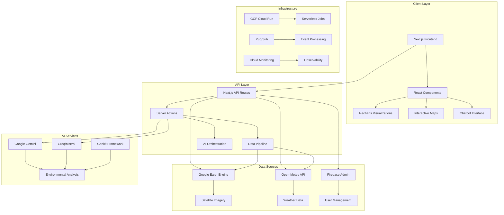
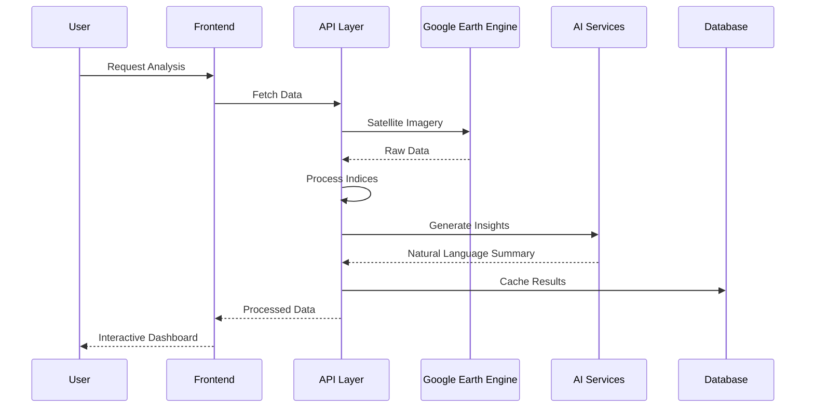
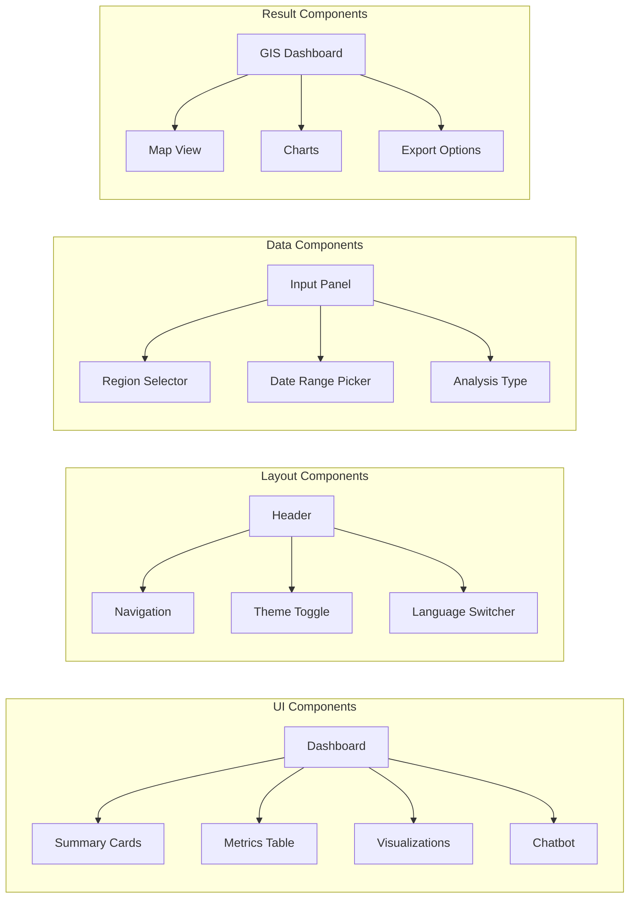

# Earth Insights Analysis Platform

**Version:** 0.1.0 | **License:** MIT | **Status:** Development

---

A comprehensive geospatial analytics platform powered by NASA Landsat satellite imagery, real-time meteorological data, and AI-driven insights for environmental monitoring and agricultural optimization.

---

**Key Sections:**
- [Features](#features) | [Architecture](#architecture) | [Quick Start](#quick-start) | [Deployment](#deployment) | [API Reference](#api-reference) | [Contributing](#contributing)

---

## Table of Contents

- [Features](#features)
- [Architecture](#architecture)
- [Tech Stack](#tech-stack)
- [Quick Start](#quick-start)
- [Project Structure](#project-structure)
- [Environment Variables](#environment-variables)
- [Development](#development)
- [Testing](#testing)
- [Deployment](#deployment)
- [API Reference](#api-reference)
- [Performance](#performance)
- [Security](#security)
- [Contributing](#contributing)
- [License](#license)

---

## Features

### Geospatial Analytics
- **NDVI Analysis** - Normalized Difference Vegetation Index for vegetation health monitoring
- **NDWI Analysis** - Normalized Difference Water Index for surface water detection
- **NDBI Analysis** - Normalized Difference Built-up Index for urban expansion monitoring
- **NBR Analysis** - Normalized Burn Ratio for fire severity assessment

### Land Cover Classification
- Automated change detection between historical and current satellite imagery
- Deforestation tracking and analysis
- Urbanization monitoring
- Water body fluctuation detection

### AI-Powered Insights
- **Google Gemini** integration for natural language environmental summaries
- **Multi-provider fallback** (Groq, Mistral, HuggingFace) for AI availability
- Predictive agricultural advice
- Real-time environmental trend analysis

### Meteorological Integration
- Real-time weather data from Open-Meteo API
- Historical weather pattern analysis
- Soil moisture and precipitation correlation
- Climate trend visualization

### Interactive Dashboards
- Real-time data visualization with Recharts
- Interactive map components
- Customizable metrics display
- Exportable reports and analytics

---

## Architecture

### System Architecture Overview



### Data Flow Architecture



### Component Architecture



---

## Tech Stack

### Core Technologies

| Category | Technology | Version | Purpose |
|----------|------------|---------|---------|
| **Framework** | Next.js | 15.5.12 | Full-stack React framework |
| **Language** | TypeScript | 5.5 | Type-safe development |
| **UI Library** | React | 18.3 | Component-based UI |
| **Styling** | Tailwind CSS | 3.4 | Utility-first CSS |
| **AI Framework** | Google Genkit | 1.21.0 | AI orchestration |
| **Geospatial** | Google Earth Engine | 0.1.411 | Satellite data processing |
| **Database** | Firebase Admin | 13.6 | Backend services |

### UI Components

| Component | Library | Purpose |
|-----------|---------|---------|
| **Animations** | Radix UI | Accessible UI primitives |
| **Charts** | Recharts | Data visualization |
| **Icons** | Lucide React | Icon library |
| **Forms** | React Hook Form | Form management |
| **Validation** | Zod | Schema validation |
| **Date Handling** | date-fns | Date utilities |

### Development Tools

| Tool | Purpose |
|------|---------|
| **ESLint** | Code linting |
| **Prettier** | Code formatting |
| **Vitest** | Unit testing |
| **Playwright** | E2E testing |
| **Husky** | Git hooks |
| **lint-staged** | Pre-commit checks |

---

## Quick Start

### Prerequisites

- **Node.js** >= 24.11.1 < 25
- **npm** or **yarn**
- **Google Cloud Account** (for Earth Engine and Firebase)
- **API Keys** (Gemini, Groq, Mistral - optional)

### Installation

```bash
# Clone the repository
git clone https://github.com/your-org/earth-insights.git
cd earth-insights

# Install dependencies
npm install

# Copy environment variables
cp .env.example .env

# Configure environment variables (see Environment Variables section)
# Edit .env with your API keys and credentials
```

### Environment Setup

```bash
# Start development server
npm run dev

# In a separate terminal, start Genkit AI server
npm run genkit:dev
```

### Verify Installation

1. Open [http://localhost:9003](http://localhost:9003)
2. Navigate to the dashboard
3. Select a region for analysis
4. Verify satellite imagery loads
5. Test AI chatbot functionality

---

## Project Structure

```
earth-insights/
├── src/
│   ├── ai/                    # AI services and orchestration
│   │   ├── flows/             # AI workflow definitions
│   │   ├── tools/             # AI tool implementations
│   │   ├── genkit.ts          # Genkit configuration
│   │   ├── providers.ts       # AI provider management
│   │   └── rate-limiter.ts    # Rate limiting logic
│   ├── app/                   # Next.js App Router
│   │   ├── crop-advisor/      # Crop recommendation feature
│   │   ├── dashboard/         # Main analytics dashboard
│   │   ├── predict/           # Prediction interface
│   │   ├── pricing/           # Pricing plans
│   │   ├── settings/          # User settings
│   │   └── layout.tsx         # Root layout
│   ├── components/            # React components
│   │   ├── ui/                # Reusable UI components
│   │   ├── dashboard.tsx      # Main dashboard component
│   │   ├── chatbot.tsx        # AI chatbot interface
│   │   └── visualizations.tsx # Chart components
│   ├── data-pipeline/         # Data processing pipelines
│   ├── gcp-orchestration/     # GCP serverless workflows
│   ├── hooks/                 # Custom React hooks
│   ├── lib/                   # Utility functions
│   │   ├── actions.ts         # Server actions
│   │   ├── firebase.ts        # Firebase configuration
│   │   ├── security.ts        # Security utilities
│   │   └── utils.ts           # Helper functions
│   ├── ml/                    # Machine learning models
│   ├── services/              # External API integrations
│   │   └── open-meteo.ts      # Weather data service
│   ├── test/                  # Test files
│   └── types/                 # TypeScript definitions
├── infra/                     # Infrastructure as Code
│   └── gcp/                   # GCP configurations
│       ├── budgets/           # Cost management
│       ├── cloud-run-jobs/    # Serverless jobs
│       ├── monitoring/        # Observability
│       ├── pubsub/            # Event messaging
│       └── workflows/         # GCP Workflows
├── scripts/                   # Build and deployment scripts
├── e2e/                       # End-to-end tests
├── .github/                   # GitHub Actions workflows
└── docs/                      # Documentation
```

---

## Environment Variables

### Required Variables

| Variable | Description | Example |
|----------|-------------|---------|
| `NODE_ENV` | Runtime environment | `development` |
| `GEMINI_API_KEY` | Google Gemini API key | `AIza...` |
| `GOOGLE_APPLICATION_CREDENTIALS_JSON` | GCP service account JSON | `{"type":"service_account",...}` |
| `GOOGLE_CLOUD_PROJECT` | GCP project ID | `earth-insights-prod` |

### Optional Variables

| Variable | Description | Default |
|----------|-------------|---------|
| `GROQ_API_KEY` | Groq API key (fallback AI) | - |
| `MISTRAL_API_KEY` | Mistral API key (fallback AI) | - |
| `HUGGINGFACE_API_KEY` | HuggingFace API key | - |
| `GOOGLE_CLOUD_REGION` | GCP region | `us-central1` |
| `GCP_PIPELINE_TOPIC_PREFIX` | Pub/Sub topic prefix | `earth-insights.pipeline` |
| `GCP_MONTHLY_BUDGET_USD` | Monthly cost limit | `1200` |
| `GCP_DAILY_RUN_QUOTA` | Daily API call limit | `6` |

### Security Notes

- Never commit `.env` files to version control
- Use environment-specific `.env.production` for deployments
- Rotate API keys regularly
- Use IAM roles instead of service account keys in production

---

## Development

### Available Scripts

```bash
# Development
npm run dev              # Start Next.js dev server (port 9003)
npm run genkit:dev       # Start Genkit AI server
npm run genkit:watch     # Start Genkit with file watching

# Code Quality
npm run lint             # Run ESLint
npm run lint:fix         # Auto-fix linting issues
npm run format           # Format code with Prettier
npm run format:check     # Check formatting
npm run typecheck        # TypeScript type checking

# Testing
npm run test             # Run unit tests
npm run test:watch       # Run tests in watch mode
npm run test:contracts   # Run contract tests
npm run test:e2e         # Run E2E tests with Playwright

# Data Pipeline
npm run pipeline:run             # Execute data pipeline
npm run pipeline:benchmark       # Benchmark pipeline performance

# Machine Learning
npm run ml:phase2               # Run ML phase 2
npm run ml:phase2:test          # Test ML phase 2

# GCP Orchestration
npm run gcp:phase3              # Run GCP phase 3
npm run gcp:phase3:test         # Test GCP phase 3

# Security
npm run security:audit          # Audit dependencies for vulnerabilities
```

### Development Workflow

1. **Feature Development**
   ```bash
   git checkout -b feature/your-feature
   npm run dev
   # Make changes
   npm run test
   npm run lint
   git commit -m "feat: add your feature"
   ```

2. **Code Review**
   - Ensure all tests pass
   - Run type checking
   - Verify linting passes
   - Test edge cases

3. **Pre-commit Hooks**
   - ESLint auto-fix
   - Prettier formatting
   - TypeScript validation

---

## Testing

### Unit Testing

```bash
# Run all unit tests
npm run test

# Run specific test file
npm run test -- src/test/action-contracts.test.ts

# Run tests in watch mode
npm run test:watch
```

### Contract Testing

```bash
# Test API contracts
npm run test:contracts
```

### End-to-End Testing

```bash
# Run E2E tests
npm run test:e2e

# Run specific E2E test
npx playwright test dashboard.spec.ts
```

### Test Coverage

```bash
# Generate coverage report
npm run test -- --coverage

# View coverage report
open coverage/index.html
```

---

## Deployment

### Firebase App Hosting

```bash
# Build for production
npm run build

# Deploy to Firebase
firebase deploy
```

### Google Cloud Run

```bash
# Build Docker image
docker build -t earth-insights .

# Deploy to Cloud Run
gcloud run deploy earth-insights \
  --image earth-insights \
  --region us-central1 \
  --allow-unauthenticated
```

### Environment-Specific Deployment

```bash
# Production
NODE_ENV=production npm run build

# Staging
NODE_ENV=staging npm run build
```

### CI/CD Pipeline

The project uses GitHub Actions for continuous integration:

1. **Pull Request Checks**
   - TypeScript compilation
   - ESLint validation
   - Unit tests
   - Contract tests

2. **Main Branch Deployment**
   - Build optimization
   - E2E tests
   - Security scanning
   - Production deployment

---

## API Reference

### Server Actions

#### Analyze Region
```typescript
// src/lib/actions.ts
export async function analyzeRegion(params: {
  region: string;
  startDate: string;
  endDate: string;
  indices: string[];
}): Promise<AnalysisResult>
```

#### Get Weather Data
```typescript
// src/services/open-meteo.ts
export async function getWeatherData(params: {
  latitude: number;
  longitude: number;
  startDate: string;
  endDate: string;
}): Promise<WeatherData>
```

#### AI Analysis
```typescript
// src/ai/flows/
export async function generateInsights(data: {
  satelliteData: SatelliteData;
  weatherData: WeatherData;
  region: string;
}): Promise<AIInsights>
```

### Data Types

```typescript
// src/types/
interface AnalysisResult {
  region: string;
  dateRange: DateRange;
  indices: {
    ndvi: number[];
    ndwi: number[];
    ndbi: number[];
    nbr: number[];
  };
  metadata: {
    cloudCover: number;
    resolution: number;
    source: string;
  };
}

interface WeatherData {
  temperature: number[];
  precipitation: number[];
  humidity: number[];
  soilMoisture: number[];
}
```

---

## Performance

### Optimization Strategies

- **Server-Side Rendering** - Initial page loads optimized with SSR
- **Static Generation** - Cached pages for repeated access
- **Image Optimization** - Next.js Image component for satellite imagery
- **Code Splitting** - Automatic route-based splitting
- **Caching** - Redis caching for API responses

### Monitoring

- **Core Web Vitals** - LCP, FID, CLS tracking
- **API Response Times** - Real-time performance monitoring
- **Error Tracking** - Sentry integration
- **Analytics** - User behavior tracking

---

## Security

### Authentication & Authorization

- **Firebase Authentication** - User management
- **JWT Tokens** - Secure API access
- **Role-Based Access Control** - Permission management

### Data Protection

- **Encryption at Rest** - AES-256 for stored data
- **Encryption in Transit** - TLS 1.3 for API calls
- **Input Validation** - Zod schema validation
- **SQL Injection Prevention** - Parameterized queries

### API Security

- **Rate Limiting** - Request throttling
- **CORS Configuration** - Cross-origin protection
- **Content Security Policy** - XSS prevention
- **API Key Rotation** - Automated key management

---

## Contributing

### Development Setup

1. Fork the repository
2. Create a feature branch
3. Set up development environment
4. Make your changes
5. Submit a pull request

### Code Standards

- **TypeScript** - Strict type checking
- **ESLint** - Zero warnings policy
- **Prettier** - Consistent formatting
- **Testing** - Minimum 80% coverage

### Commit Convention

```
feat: add new feature
fix: bug fix
docs: documentation update
style: formatting changes
refactor: code refactoring
test: add tests
chore: maintenance tasks
```

---

## License

This project is licensed under the MIT License - see the [LICENSE](LICENSE) file for details.

---

## Support

- **Documentation** - [docs/](docs/)
- **Issues** - [GitHub Issues](https://github.com/your-org/earth-insights/issues)
- **Discussions** - [GitHub Discussions](https://github.com/your-org/earth-insights/discussions)
- **Email** - support@earth-insights.com

---

<p align="center">
  <strong>Built for environmental monitoring and agricultural optimization</strong>
</p>