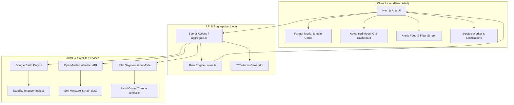

# Kisan Alert

**Farmer Promise:** *“Tell me, in my language, whether I need to water, spray, or worry today.”*

**Version:** 1.0.0 | **License:** MIT | **Status:** Production-Ready

---

Kisan Alert is a farmer-first environmental alert, irrigation scheduling, and agricultural operations advisory platform. It transforms complex satellite data, meteorological forecasts, and machine learning models into simple, high-contrast, accessible alerts in 12 major Indian languages.

---

**Key Sections:**
- [Key Features](#key-features) | [System Architecture](#system-architecture) | [Core Components](#core-components) | [Quick Start](#quick-start) | [Setup & Environment](#setup--environment) | [Testing](#testing)

---

## Key Features

### 1. Unified Alert Engine
- **Evaluation Rules:** Automatically triggers alerts when environmental parameters cross critical agricultural thresholds (e.g. soil moisture < 20%, expected rain > 10mm, extreme temperature > 40°C, strong wind > 25 km/h, high flood/drought risks).
- **Normalized Alert Format:** Consolidates diverse data streams into a single type-safe model categorized by operational areas (Water, Weather, Crop, Disease, Flood, Drought, Yield, Advisory).

### 2. Multi-Lingual Text-To-Speech (TTS)
- Integrated voice-assist capabilities that narrate alerts in the farmer's selected language (supports English, Hindi, Bengali, Telugu, Marathi, Tamil, Gujarati, Kannada, Odia, Malayalam, Punjabi, Assamese) utilizing the server-side Genkit TTS flow.

### 3. Accessible, Outdoor-Readable UX
- Designed with high-contrast, bold colors, large touch targets (minimum 44x44px), and clear, tap-friendly action panels suited for outdoor sunlight use by elderly farmers.
- Easily toggleable between **Farmer Mode** (simple, actionable advisory cards) and **Advanced Mode** (geospatial analysis and GEE charts).

### 4. Offline Support & Browser Notifications
- Service Worker integration supporting background fetch intercepts, notifications click focusing, and caching strategies.
- Periodically polls for live alerts and notifies the user via desktop notifications when HIGH or CRITICAL issues are identified.

---

## System Architecture



---

## Core Components & Structure

```
src/
├── lib/
│   └── alerts/
│       ├── types.ts          # Core KisanAlert interface definition
│       ├── rules.ts          # Pure threshold logic for farming alerts
│       └── aggregate.ts      # Normalizes inputs from server actions
├── hooks/
│   ├── use-alerts.tsx        # Periodic polling, notifications, and badges
│   └── use-farmer-mode.tsx   # Manages mode switches and auto-routing
├── components/
│   ├── alert-badge.tsx       # Severity-styled badges (Red, Orange, Yellow, Green)
│   ├── alert-feed.tsx        # Unified alerts feed list with TTS capability
│   ├── kisan-home-cards.tsx  # Touch-friendly panels for farming summaries
│   └── header.tsx            # Navigation header with unread badge & Farmer Switch
└── app/
    ├── kisan/                # Farmer landing page (/kisan)
    └── alerts/               # Alert details & search page (/alerts)
```

---

## Quick Start

### Installation

```bash
# Install dependencies
npm install

# Copy environment variables
cp .env.example .env

# Run development server
npm run dev

# Run Genkit development server
npm run genkit:dev
```

Open [http://localhost:9003](http://localhost:9003) to access the application. Toggle **Farmer Mode** in the header to view the Kisan Alert interface.

---

## Testing & Quality Assurance

```bash
# Run unit tests (including alerts/rules contract tests)
npm run test

# Run typescript compilation validation
npm run typecheck

# Run ESLint linter verification
npm run lint
```